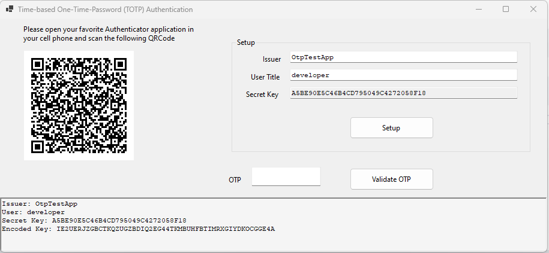

# Two Factor Authentication in C# using a mobile phone Authenticator application

For security reasons many today applications or web sites use a **two-step authentication**. 

This type of authentication is called [Multi Factor or Two Factor Authentication](https://en.wikipedia.org/wiki/Multi-factor_authentication).

The user is prompted to enter `username` and `password` and right after that is prompted to enter another code.

For that second step the application developer has a number of choices:

- email a code to the user
- sms a code to the user
- require a code produced by an [authenticator application](https://www.lenovo.com/us/en/glossary/authenticator-app/).

## Authenticator applications

An authenticator application is a mobile phone application. There is a number of free authenticator applications

- [Microsoft Authenticator](https://support.microsoft.com/en-us/account-billing/download-microsoft-authenticator-351498fc-850a-45da-b7b6-27e523b8702a)
- [Google Authenticator](https://play.google.com/store/apps/details?id=com.google.android.apps.authenticator2)
- [Authy](https://authy.com/)
- [FreeOtp+](https://play.google.com/store/apps/details?id=org.liberty.android.freeotpplus)

In a mobile authenticator application the user may create a list of accounts. Such an account is comprised of 
- the **user name or title**
- the **name of the protected application, web site or service** the account relates to
- a **secret key** produced by that protected application, web site or service.


Such an account may be created manually by the user, by entering the three above elements, or just by using the barcode scanner of the authenticator application in order to scan a [QR Code](https://en.wikipedia.org/wiki/QR_code) produced by the protected application, web site or service. That QR Code incorporates all the three elements needed in creating an authenticator account.

After that account setup the authenticator application generates a unique six-digit code, called [Time-based One-Time-Password (TOTP)](https://en.wikipedia.org/wiki/Time-based_one-time_password), every 30 seconds.

The authenticator application generates the **TOTP six-digit code** based on the time and the secret key of the account. No internet connection is required.

The user gets that `TOTP six-digit code` from the authenticator application and enters it in the protected application. 

The protected application validates the entered code using, again, the time and the secret key of the account.

Both the authenticator application and the protected application store the secret key of the account in order to be able to produce and validate TOTP codes.

The protected application, web site or service, has no connection or knowledge about the authenticator application. In fact any TOTP compliant authenticator can be used.

The [Internet Engineering Task Force (IETF)](https://en.wikipedia.org/wiki/Internet_Engineering_Task_Force) describes the TOTP algorithm in the [rfc6238 specification](https://datatracker.ietf.org/doc/html/rfc6238). Both the TOTP authenticator application and the protected application implement the TOTP algorithm.

## C# TOTP Libraries

There is a number of C# TOTP libraries out there.

- [GoogleAuthenticator](https://github.com/BrandonPotter/GoogleAuthenticator)
- [TwoStepsAuthenticator](https://github.com/glacasa/TwoStepsAuthenticator)
- [TwoFactorAuth.Net](https://github.com/kspearrin/Otp.NET)
- [TOTP](https://github.com/AndreiLucaci/TOTP)
- [Easy-Totp](https://github.com/alicommit-malp/Easy-Totp)

There is also the [QRCoder](https://github.com/codebude/QRCoder/) library for generating QR Codes (barcodes).

What these TOTP libraries do is that they produce a QR Code given 
- the **user name or title**
- the **name of the protected application, web site or service** they work for
- a **secret key** that uniquely identifies the user in the protected application.

 For example:

 ```
tbebekis
MyApp
A_LONG_SECRET_KEY_HERE
 ```

Also these TOTP libraries are able to validate an OTP and decide if it is valid or not.

## The demo application



The demo application uses the [GoogleAuthenticator](https://github.com/BrandonPotter/GoogleAuthenticator) library.

It hides almost everything inside a static class.

```
    static public class Totp
    {
        static TwoFactorAuthenticator TFA = new TwoFactorAuthenticator();

        /* public */
        static public string Normalize(string Text)
        {
            if (!string.IsNullOrWhiteSpace(Text))
            {
                Text = Text.Trim();
                Text = Text.Replace("-", "");
                Text = Text.Replace(" ", "");
            }

            return Text;
        }
        static public SetupCode CreateSetup(string Issuer, string UserTitle, string UserSecretKey)
        {
            if (string.IsNullOrWhiteSpace(Issuer) && string.IsNullOrWhiteSpace(UserTitle) && string.IsNullOrWhiteSpace(UserSecretKey))
                throw new ApplicationException("Cannot create OTP Setup with null or empty values");

            UserTitle = Totp.Normalize(UserTitle);
            UserSecretKey = Totp.Normalize(UserSecretKey);
            return TFA.GenerateSetupCode(Issuer, UserTitle, UserSecretKey, false, 3);
        }
        static public bool ValidateOtp(string UserSecretKey, string OTP)
        {
            UserSecretKey = Totp.Normalize(UserSecretKey);
            return TFA.ValidateTwoFactorPIN(UserSecretKey, OTP, false);
        }

        /* public - helpers */
        static public string QrAsDataUrl(this SetupCode Setup)
        {
            return Setup.QrCodeSetupImageUrl;
        }
        static public string QrAsBase64(this SetupCode Setup)
        {
            return Setup.QrCodeSetupImageUrl.Replace("data:image/png;base64,", "");
        }
        static public Image QrAsImage(this SetupCode Setup)
        {
            string Base64 = Setup.QrCodeSetupImageUrl.Replace("data:image/png;base64,", "");
            using (MemoryStream MS = new MemoryStream(Convert.FromBase64String(Base64)))
                return Image.FromStream(MS);
        }
    }
```

The main form creates the `Secret Key` by striping `-` from a `GUID`. 

Using the entered information, i.e. `Issuer`, `User Title` and the `Secret Key` generates the QR Code.

The user has to scan that QR Code with a mobile authenticator application and start entering OTP codes for validation in the form.

I've tested all the authenticator applications mentioned in the beginning of this text and it works fine.